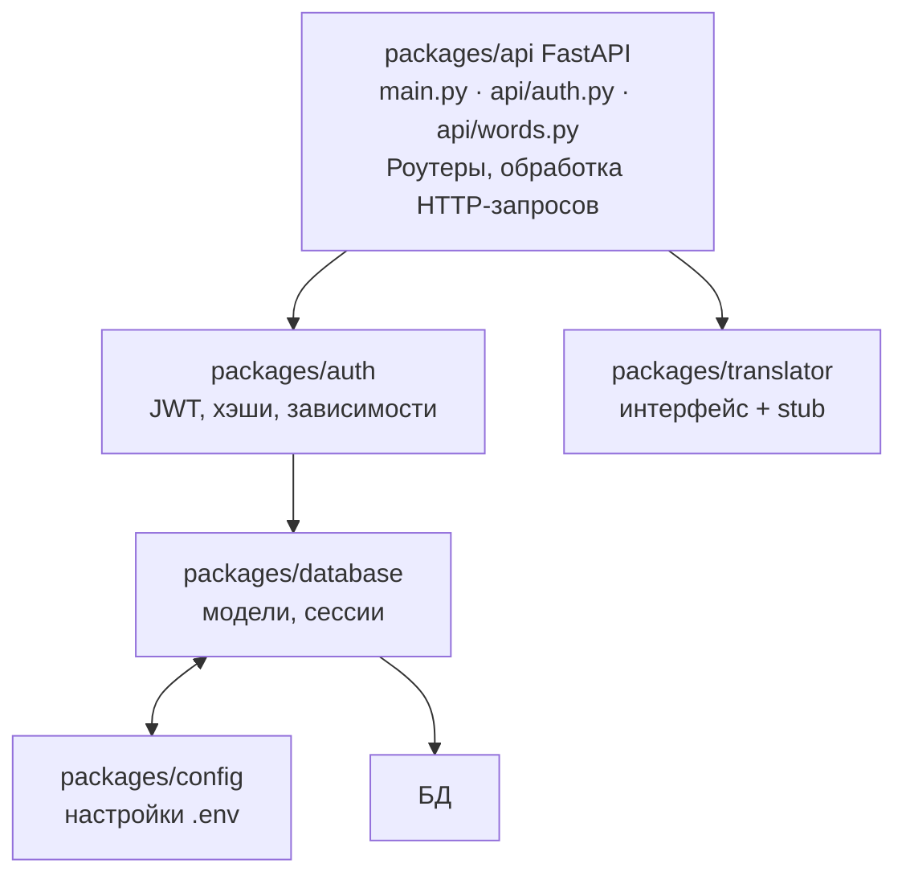
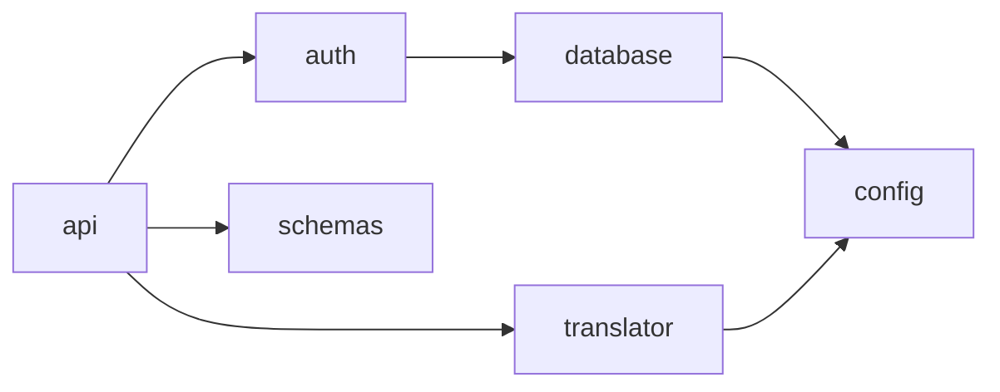
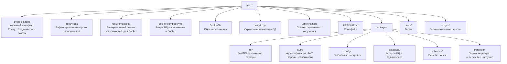

# Aliaz

Бэкенд-сервис для изучения иностранных слов. Реализует **регистрацию**, **авторизацию** и **аутентификацию** пользователей, а также **запись слов** с автоматическим переводом.

Проект построен на **FastAPI** и организован как **монорепозиторий** (monorepo) — несколько независимых Python-пакетов, собранных в одном репозитории.

> **Для новичка:** этот README — отправная точка. Он объясняет, что делает проект, как он устроен и в каком порядке читать код. Если вы только начинаете — начните отсюда, а затем переходите к README каждого пакета по порядку, указанному в разделе «Порядок чтения».

---

## Что делает проект

Пользователь может:

1. **Зарегистрироваться** — создать аккаунт по `nickname`, `email` и `password`.
2. **Войти** — получить JWT-токены для доступа к API.
3. **Добавлять слова** — сервис автоматически переводит слово (сейчас через заглушку) и сохраняет его.
4. **Управлять словами** — просматривать список своих слов, получать одно слово, удалять.

Каждый пользователь видит и редактирует **только свои** слова.

---

## Технологический стек

| Технология | Зачем используется |
|-----------|--------------------|
| **FastAPI** | Веб-фреймворк для создания API (обработка HTTP-запросов) |
| **Uvicorn** | ASGI-сервер, который запускает FastAPI-приложение |
| **Pydantic** | Валидация данных (проверка входящих/исходящих данных) |
| **Pydantic Settings** | Загрузка настроек из переменных окружения и файла `.env` |
| **SQLAlchemy (async)** | ORM — работа с базой данных через Python-объекты |
| **asyncpg / aiosqlite** | Асинхронные драйверы для PostgreSQL и SQLite |
| **PyJWT** | Создание и проверка JWT-токенов |
| **bcrypt** | Хэширование паролей |
| **slowapi** | Ограничение частоты запросов (rate limiting) |
| **OpenAI** | Реальный сервис перевода (подключается при наличии API-ключа) |
| **Poetry** | Менеджер зависимостей и пакетов |
| **pytest** | Написание и запуск тестов |

---

## Архитектура

Проект разделён на **слои** — каждый пакет отвечает за свою часть работы:



### Слои (уровни ответственности)

1. **API-слой** (`packages/api`) — FastAPI-приложение. Здесь живут роутеры (обработчики URL), которые принимают HTTP-запросы, вызывают нужную логику и возвращают ответы.
2. **Сервисный слой** (`packages/auth`, `packages/translator`) — бизнес-логика: безопасность (пароли, токены) и перевод слов.
3. **Слой данных** (`packages/database`) — ORM-модели (описание таблиц), асинхронные сессии, инициализация БД.
4. **Слой схем** (`packages/schemas`) — Pydantic-модели, описывающие формат данных запросов и ответов.
5. **Конфигурация** (`packages/config`) — настройки из переменных окружения / `.env`.

### Как пакеты связаны между собой

Зависимости между пакетами направлены «вниз» — от API к данным и конфигурации:

- `api` зависит от: `auth`, `database`, `schemas`, `translator`, `config`
- `auth` зависит от: `config`, `database`
- `database` зависит от: `config`
- `translator` зависит от: `config`
- `schemas` зависит только от `pydantic`
- `config` — самый «нижний» пакет, ни от кого не зависит



---

## Структура репозитория



---

## Порядок чтения проекта для новичка

Рекомендуется читать проект «снизу вверх» — от фундамента к вершине. Так вы сначала поймёте базовые строительные блоки, а затем увидите, как они собираются в работающее приложение.

| Шаг | Что читать | Почему |
|-----|-----------|--------|
| 1 | **Корневые файлы** (`pyproject.toml`, `.env.example`, `init_db.py`, `docker-compose.yml`) | Понять, какие пакеты есть, какие зависимости и как всё запускается |
| 2 | **`packages/config`** | Самый «нижний» пакет. Настройки используются всеми остальными |
| 3 | **`packages/schemas`** | Pydantic-модели данных. Понять, какие данные «ходят» по API |
| 4 | **`packages/database`** | Модели таблиц и подключение к БД |
| 5 | **`packages/auth`** | Логика безопасности: пароли, JWT, зависимости |
| 6 | **`packages/translator`** | Сервис перевода (интерфейс + заглушка) |
| 7 | **`packages/api`** | FastAPI-приложение, которое связывает всё вместе |
| 8 | **`tests/`** | Тесты — лучший способ увидеть, как всё работает на практике |

> **Почему такой порядок?** Каждый пакет использует только «нижние» пакеты. Читая снизу вверх, вы никогда не встретите незнакомый код: к моменту чтения `api` вы уже знаете все его зависимости.

---

## Запуск проекта

### Локально (без Docker)

```bash
# 1. Установка зависимостей (корневой пакет + все подпакеты)
poetry install

# 2. Настройка окружения
cp .env.example .env

# 3. Инициализация базы данных
poetry run python init_db.py

# 4. Запуск сервера
poetry run uvicorn packages.api.api.main:app --reload
```

После запуска:

- API доступно по адресу: `http://localhost:8000`
- Интерактивная документация (Swagger UI): `http://localhost:8000/docs`

### Через Docker Compose

```bash
cp .env.example .env
docker compose up --build
```

Docker Compose поднимет два сервиса:

- **db** — PostgreSQL 16
- **web** — приложение (собирается из `Dockerfile`)

---

## Переменные окружения (`.env`)

Основные настройки описаны в `.env.example`. Ключевые переменные:

| Переменная | Назначение |
|-----------|-----------|
| `DATABASE_URL` | Строка подключения к БД |
| `JWT_SECRET` | Секрет для подписи токенов (обязательно смените в продакшене!) |
| `JWT_EXPIRE_MINUTES` | Время жизни access-токена (мин) |
| `JWT_REFRESH_EXPIRE_MINUTES` | Время жизни refresh-токена (мин) |
| `OPENAI_API_KEY` | Ключ OpenAI (если пусто — используется заглушка перевода) |
| `ALLOWED_HOSTS` | Разрешённые хосты (JSON-список) |
| `DEBUG` | Режим отладки |

---

## API (сводка)

Все эндпоинты имеют префикс `/api/v1`.

| Метод | Путь | Аутентификация | Описание |
|-------|------|----------------|----------|
| GET | `/` | нет | Проверка работоспособности |
| POST | `/api/v1/auth/register` | нет | Регистрация |
| POST | `/api/v1/auth/login` | нет | Авторизация |
| POST | `/api/v1/auth/refresh` | refresh-токен | Обновление access-токена |
| GET | `/api/v1/auth/me` | access-токен | Текущий пользователь |
| POST | `/api/v1/words` | access-токен | Добавить слово (с переводом) |
| GET | `/api/v1/words` | access-токен | Список своих слов |
| GET | `/api/v1/words/{id}` | access-токен | Одно слово |
| DELETE | `/api/v1/words/{id}` | access-токен | Удалить слово |

---

## Модели данных

**User** (`users`)

| Поле | Тип | Примечание |
|------|-----|-----------|
| `id` | int | Первичный ключ |
| `nickname` | str | Уникальный |
| `email` | str | Уникальный |
| `password_hash` | str | bcrypt-хэш пароля |
| `telegram_nickname` | str? | Опционально |

**Word** (`words`)

| Поле | Тип | Примечание |
|------|-----|-----------|
| `id` | int | Первичный ключ |
| `owner_id` | int | Внешний ключ → `users.id` |
| `word_en` | str | Исходное слово |
| `translation` | str? | Перевод от сервиса |
| `transcription` | str? | Транскрипция |
| `corrected_word` | str? | Исправленное (нормализованное) слово |
| `created_at` | datetime | Время создания |

---

## Тестирование

```bash
poetry run pytest
```

Тесты используют изолированную in-memory базу данных (SQLite), поэтому не требуют внешней БД. Подробнее — в [`tests/README.md`](tests/README.md).

---

## Планы по развитию

- Подключение реального сервиса-переводчика (DeepL / Google Translate / Yandex) через реализацию интерфейса `Translator`.
- Refresh-токены и logout (отзыв токенов).
- Подтверждение email, сброс пароля.
- Повторение слов (spaced repetition), статистика.