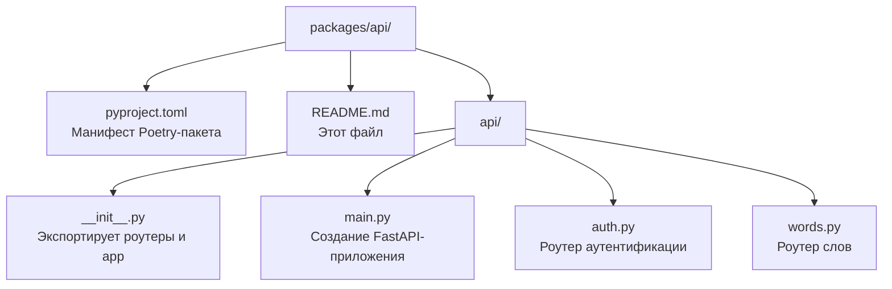

# Пакет `api`

Пакет **`api`** — это **FastAPI-приложение**, верхний слой проекта. Он связывает все остальные пакеты вместе и предоставляет HTTP-интерфейс для клиентов.

> **Для новичка:** FastAPI — это веб-фреймворк для создания API. «Роутер» (router) — это набор обработчиков URL. «Эндпоинт» — конкретный URL, который принимает запросы (например, `POST /api/v1/auth/register`). Этот пакет — «лицо» проекта: всё, что видит пользователь, обрабатывается здесь.

---

## Назначение и роль в системе

- **Создание FastAPI-приложения** — файл `main.py` собирает приложение, подключает middleware и роутеры.
- **Обработка HTTP-запросов** — роутеры `auth.py` и `words.py` обрабатывают запросы к API.
- **Связывание пакетов** — использует `auth` (безопасность), `database` (БД), `schemas` (валидация), `translator` (перевод), `config` (настройки).

Это **самый верхний** пакет — он зависит от всех остальных.

---

## Структура пакета



### Порядок чтения файлов

1. `pyproject.toml` — понять зависимости.
2. `api/main.py` — как создаётся приложение (middleware, роутеры).
3. `api/auth.py` — роутер аутентификации.
4. `api/words.py` — роутер слов.
5. `api/__init__.py` — как пакет экспортирует наружу.

---

## `api/main.py` — создание приложения

Это главный файл, который создаёт FastAPI-приложение.

### Создание приложения

```python
app = FastAPI(
    title=settings.app_name,
    version=settings.app_version,
    debug=settings.debug,
)
```

### Middleware (промежуточное ПО)

Middleware — это код, который обрабатывает запросы до того, как они попадут в эндпоинт, и ответы после.

- **`CORSMiddleware`** — разрешает запросы с других доменов (CORS).
- **`TrustedHostMiddleware`** — блокирует запросы с неразрешённых хостов.
- **Rate limiter (slowapi)** — ограничивает частоту запросов (`200 в день`, `50 в час`).
- **`log_requests`** — логирует входящие запросы (метод, путь, статус, время).

### Подключение роутеров

```python
app.include_router(auth_router, prefix="/api/v1")
app.include_router(words_router, prefix="/api/v1")
```

Все эндпоинты получают префикс `/api/v1`.

### Корневой эндпоинт

```python
@app.get("/")
async def root():
    return {"status": "ok", "message": f"Welcome to {settings.app_name} API"}
```

### Завершение работы

```python
@app.on_event("shutdown")
async def shutdown_event():
    await engine.dispose()  # закрыть соединения с БД
```

---

## `api/auth.py` — роутер аутентификации

Роутер с префиксом `/auth`. Содержит эндпоинты:

| Метод | Путь | Описание |
|-------|------|----------|
| POST | `/auth/register` | Регистрация нового пользователя |
| POST | `/auth/login` | Вход по email и паролю |
| POST | `/auth/refresh` | Обновление access-токена |
| GET | `/auth/me` | Данные текущего пользователя |

### `register`

1. Принимает `RegisterRequest` (nickname, email, password, telegram_nickname).
2. Проверяет, что email и nickname не заняты (иначе `409 Conflict`).
3. Хэширует пароль через `hash_password`.
4. Сохраняет пользователя в БД.
5. Возвращает `TokenResponse` с access и refresh токенами.

### `login`

1. Принимает `LoginRequest` (email, password).
2. Ищет пользователя по email.
3. Проверяет пароль через `verify_password`.
4. При успехе возвращает токены; при неверных данных — `401`.

### `refresh`

1. Принимает `RefreshRequest` (refresh_token).
2. Декодирует refresh-токен через `decode_refresh_token`.
3. Проверяет, что пользователь существует.
4. Возвращает новую пару токенов (refresh ротируется).

### `me`

1. Использует зависимость `get_current_user`.
2. Возвращает данные текущего пользователя.

---

## `api/words.py` — роутер слов

Роутер с префиксом `/words`. Все эндпоинты защищены зависимостью `get_current_user`.

| Метод | Путь | Описание |
|-------|------|----------|
| POST | `/words` | Добавить слово (с переводом) |
| GET | `/words` | Список слов пользователя |
| GET | `/words/{id}` | Одно слово |
| DELETE | `/words/{id}` | Удалить слово |

### `create_word`

1. Принимает `WordCreateRequest` (word_en, source_lang, target_lang).
2. Получает переводчик через `get_translator()`.
3. Переводит слово.
4. Сохраняет слово с переводом, привязывая к текущему пользователю.

### `list_words`

Возвращает список слов текущего пользователя, отсортированный по дате создания (новые сверху).

### `get_word`

Возвращает одно слово. Если слово не найдено или принадлежит другому пользователю — `404`.

### `delete_word`

Удаляет слово. Если слово не найдено или чужое — `404`. При успехе — `204`.

---

## Зависимости

| Пакет/библиотека | Зачем |
|------------------|-------|
| `fastapi` | Веб-фреймворк |
| `uvicorn` | ASGI-сервер для запуска |
| `slowapi` | Ограничение частоты запросов |
| `config` | Настройки приложения |
| `database` | Модели и сессии БД |
| `auth` | Безопасность и зависимость текущего пользователя |
| `schemas` | Валидация запросов и ответов |
| `translator` | Сервис перевода |

---

## Примеры использования

```python
from api.main import app

# Запуск приложения (из командной строки)
# uvicorn packages.api.api.main:app --reload
```

---

## Связь с другими пакетами

- **`config`** — настройки приложения (название, версия, debug, хосты, CORS).
- **`database`** — модели `User`/`Word`, сессия `get_db`.
- **`auth`** — функции безопасности и `get_current_user`.
- **`schemas`** — Pydantic-схемы запросов/ответов.
- **`translator`** — сервис перевода для добавления слов.
- **`tests`** — интеграционные тесты API (см. `tests/test_api_auth.py`, `tests/test_api_words.py`).