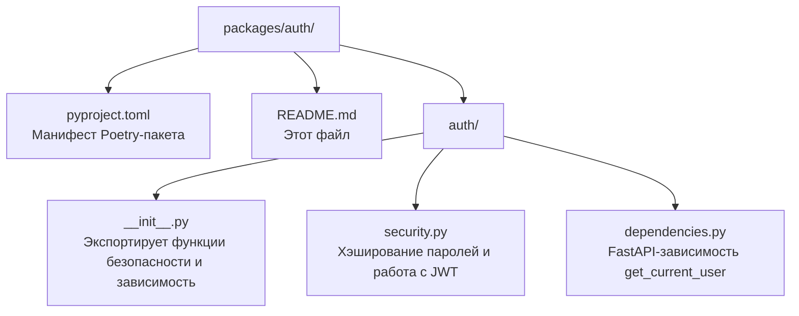

# Пакет `auth`

Пакет **`auth`** — это **слой безопасности** проекта. Он отвечает за:

- **хэширование паролей** (bcrypt),
- **создание и проверку JWT-токенов**,
- **FastAPI-зависимость** для получения текущего пользователя по токену.

> **Для новичка:** аутентификация — это «кто ты?» (проверка личности), авторизация — «что тебе можно?» (права). Этот пакет решает первую задачу: проверяет, что пользователь действительно тот, за кого себя выдаёт, с помощью токенов.

---

## Назначение и роль в системе

- **Безопасное хранение паролей** — пароли не хранятся в открытом виде, только в виде bcrypt-хэша.
- **Выпуск токенов** — после входа/регистрации создаются JWT-токены доступа и обновления.
- **Проверка токенов** — декодирование и проверка подлинности/срока действия.
- **Защита эндпоинтов** — зависимость `get_current_user` используется в API для защиты маршрутов.

Пакет зависит от `config` (настройки JWT) и `database` (модель `User`, сессия `get_db`).

---

## Структура пакета



### Порядок чтения файлов

1. `pyproject.toml` — понять зависимости (PyJWT, bcrypt, fastapi, config, database).
2. `auth/security.py` — низкоуровневые функции безопасности (пароли, токены).
3. `auth/dependencies.py` — FastAPI-зависимость для защиты эндпоинтов.
4. `auth/__init__.py` — как пакет экспортирует наружу.

---

## Функции в `auth/security.py`

### Хэширование паролей

- `hash_password(password: str) -> str` — хэширует пароль с помощью bcrypt и возвращает строку-хэш.
- `verify_password(password: str, hashed: str) -> bool` — проверяет, совпадает ли пароль с хэшем.

### JWT-токены

- `create_access_token(user_id: int) -> str` — создаёт короткоживущий access-токен (по умолчанию 60 мин).
- `decode_access_token(token: str) -> int` — декодирует access-токен и возвращает `user_id`.
- `create_refresh_token(user_id: int) -> str` — создаёт долгоживущий refresh-токен (по умолчанию 7 дней).
- `decode_refresh_token(token: str) -> int` — декодирует refresh-токен и возвращает `user_id`.

**Что внутри JWT-токена (payload):**

| Поле | Назначение |
|------|-----------|
| `sub` | ID пользователя (как строка) |
| `iat` | Время создания токена |
| `exp` | Время истечения токена |
| `type` | Тип токена: `access` или `refresh` |
| `jti` | Уникальный ID токена |

**Важно:** `decode_access_token` и `decode_refresh_token` проверяют поле `type`. Access-токен нельзя использовать как refresh-токен и наоборот — иначе будет ошибка.

---

## Зависимость в `auth/dependencies.py`

### `get_current_user`

FastAPI-зависимость, которая возвращает текущего пользователя по JWT-токену из заголовка `Authorization`.

```python
async def get_current_user(
    credentials: HTTPAuthorizationCredentials | None = Depends(bearer_scheme),
    db: AsyncSession = Depends(get_db),
) -> User:
```

**Как работает:**

1. Извлекает токен из заголовка `Authorization: Bearer <token>`.
2. Если токена нет — возвращает `401 Unauthorized`.
3. Декодирует токен через `decode_access_token`.
4. Если токен невалиден/просрочен — `401`.
5. Ищет пользователя в БД по `user_id`.
6. Если пользователь не найден — `401`.
7. Возвращает объект `User`.

**Использование в эндпоинте:**

```python
@app.get("/me")
async def me(current_user: User = Depends(get_current_user)):
    return current_user
```

FastAPI автоматически вызовет `get_current_user` и передаст результат в эндпоинт. Если пользователь не авторизован — вернётся `401`.

---

## Что такое JWT?

**JWT (JSON Web Token)** — это компактный способ передать информацию между клиентом и сервером в виде подписанного токена. Токен состоит из трёх частей:

```
header.payload.signature
```

- **header** — метаданные (алгоритм подписи).
- **payload** — данные (в нашем случае `sub`, `iat`, `exp`, `type`, `jti`).
- **signature** — подпись, которая гарантирует, что токен не подделан.

Токен подписывается секретом `settings.jwt_secret`. Если секрет неизвестен — подделать токен невозможно.

---

## Зависимости

| Пакет/библиотека | Зачем |
|------------------|-------|
| `pyjwt` | Создание и проверка JWT-токенов |
| `bcrypt` | Хэширование и проверка паролей |
| `fastapi` | Зависимости (`Depends`, `HTTPBearer`) |
| `config` | Настройки JWT (секрет, алгоритм, время жизни) |
| `database` | Модель `User`, сессия `get_db` |

---

## Примеры использования

```python
from auth import (
    hash_password, verify_password,
    create_access_token, decode_access_token,
    get_current_user,
)

# Хэширование пароля
hashed = hash_password("password123")
print(verify_password("password123", hashed))  # True

# Создание и проверка токена
token = create_access_token(user_id=42)
user_id = decode_access_token(token)  # 42
```

---

## Связь с другими пакетами

- **`api`** использует функции `hash_password`, `verify_password`, `create_access_token`, `create_refresh_token`, `decode_refresh_token` в роутере аутентификации, а `get_current_user` — для защиты роутера слов.
- **`config`** предоставляет настройки JWT.
- **`database`** предоставляет модель `User` и сессию.
- **`tests`** проверяют функции безопасности и зависимость (см. `tests/test_security.py`, `tests/test_dependencies.py`).