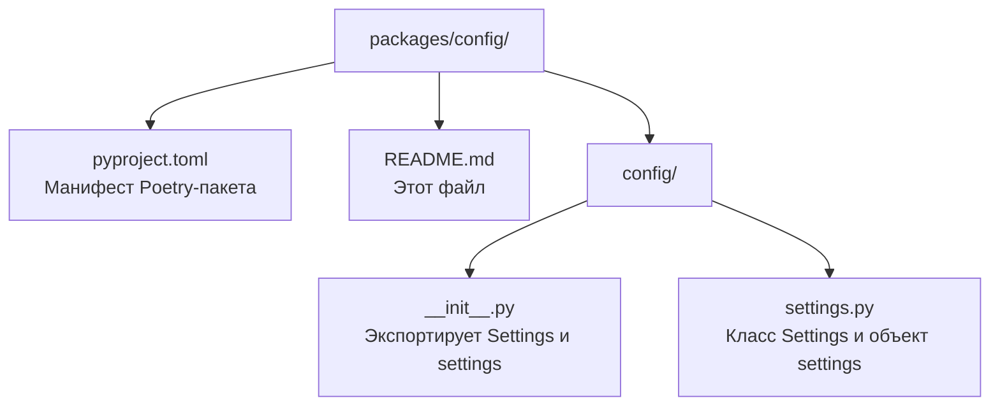

# Пакет `config`

Пакет **`config`** — это **глобальная конфигурация** всего проекта. Он хранит все настройки приложения: подключение к базе данных, параметры JWT-токенов, настройки сервера, OpenAI и CORS.

> **Для новичка:** этот пакет — «фундамент» проекта. Почти все остальные пакеты (`database`, `auth`, `translator`, `api`) импортируют отсюда объект `settings`, чтобы узнать, как настроено приложение. Читайте его первым — он простой и не зависит ни от кого.

---

## Назначение и роль в системе

- **Централизованное хранение настроек** — все параметры в одном месте, а не разбросаны по коду.
- **Загрузка из окружения** — настройки читаются из переменных окружения и файла `.env`.
- **Единая точка доступа** — другие пакеты импортируют готовый объект `settings` и используют его поля.

Пакет находится в самом низу иерархии зависимостей: **он не зависит ни от одного другого пакета проекта**, только от библиотек `pydantic` и `pydantic-settings`.

---

## Структура пакета



### Порядок чтения файлов

1. `pyproject.toml` — понять зависимости пакета (только `pydantic` и `pydantic-settings`).
2. `config/settings.py` — главный файл с классом `Settings`.
3. `config/__init__.py` — как пакет экспортирует наружу.

---

## Ключевые классы и функции

### `Settings` (в `config/settings.py`)

Класс, описывающий все настройки. Наследуется от `BaseSettings` из `pydantic-settings`.

**Поля конфигурации:**

| Поле | Тип | По умолчанию | Описание |
|------|-----|-------------|----------|
| `database_url` | str | `sqlite+aiosqlite:///./aliaz.db` | URL подключения к БД |
| `app_name` | str | `aliaz` | Название приложения |
| `app_version` | str | `0.1.0` | Версия приложения |
| `debug` | bool | `False` | Режим отладки |
| `host` | str | `0.0.0.0` | Хост для запуска сервера |
| `port` | int | `8000` | Порт для запуска сервера |
| `allowed_hosts` | list[str] | `["localhost", "127.0.0.1", "testserver"]` | Разрешённые хосты |
| `jwt_secret` | str | `change-me-in-production` | Секрет для подписи JWT |
| `jwt_algorithm` | str | `HS256` | Алгоритм подписи JWT |
| `jwt_expire_minutes` | int | `60` | Время жизни access-токена (мин) |
| `jwt_refresh_expire_minutes` | int | `10080` (7 дней) | Время жизни refresh-токена (мин) |
| `openai_api_key` | str? | `None` | Ключ OpenAI |
| `openai_model` | str | `gpt-4o-mini` | Модель OpenAI |
| `openai_base_url` | str | `https://openrouter.ai/api/v1` | Базовый URL OpenAI |
| `allowed_origins` | list[str]? | `None` | Разрешённые CORS-источники |

**Методы-валидаторы:**

- `parse_allowed_hosts` — парсит `ALLOWED_HOSTS` из JSON-строки в список.
- `parse_allowed_origins` — парсит `ALLOWED_ORIGINS` из JSON-строки в список.

**Конфигурация модели** (`model_config`):

- `env_file=".env"` — читает настройки из файла `.env`.
- `case_sensitive=False` — имена переменных окружения нечувствительны к регистру.
- `extra="ignore"` — игнорирует лишние переменные.

### `settings` (объект)

Готовый экземпляр `Settings()`, созданный один раз при импорте. Все остальные пакеты используют именно его:

```python
from config import settings

print(settings.database_url)
print(settings.jwt_secret)
```

---

## Как это работает (простыми словами)

1. При импорте пакета создаётся объект `settings = Settings()`.
2. `pydantic-settings` автоматически ищет значения в переменных окружения и в файле `.env`.
3. Если переменная не найдена — используется значение по умолчанию из класса.
4. Другие пакеты импортируют `settings` и читают нужные поля.

**Приоритет значений:** переменные окружения → файл `.env` → значения по умолчанию.

---

## Зависимости

| Пакет/библиотека | Зачем |
|------------------|-------|
| `pydantic` | Базовые классы для валидации |
| `pydantic-settings` | Загрузка настроек из окружения и `.env` |

Пакет **не зависит** от других пакетов проекта.

---

## Примеры использования

```python
from config import settings

# Получить URL базы данных
db_url = settings.database_url

# Получить секрет для JWT
secret = settings.jwt_secret

# Проверить, включён ли режим отладки
if settings.debug:
    print("Debug mode is ON")
```

---

## Связь с другими пакетами

- **`database`** использует `settings.database_url` для подключения к БД.
- **`auth`** использует `settings.jwt_secret`, `settings.jwt_algorithm`, `settings.jwt_expire_minutes` для работы с токенами.
- **`translator`** использует `settings.openai_api_key`, `settings.openai_base_url`, `settings.openai_model`.
- **`api`** использует `settings.app_name`, `settings.app_version`, `settings.debug`, `settings.allowed_hosts`, `settings.allowed_origins`.