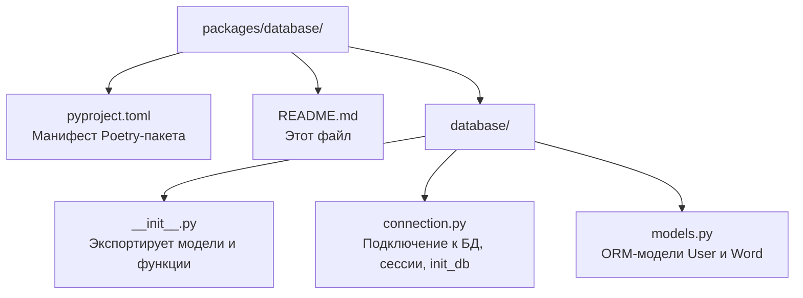

# Пакет `database`

Пакет **`database`** — это **слой данных** проекта. Он отвечает за:

- описание таблиц базы данных (ORM-модели),
- асинхронное подключение к БД,
- создание сессий для работы с БД,
- инициализацию БД (создание таблиц).

> **Для новичка:** SQLAlchemy — это ORM (Object-Relational Mapping). Он позволяет работать с базой данных через Python-объекты, не писать SQL-запросы вручную. Модель — это Python-класс, который описывает таблицу: поля класса = колонки таблицы.

---

## Назначение и роль в системе

- **Описание структуры данных** — модели `User` и `Word` определяют, какие таблицы есть в БД.
- **Подключение к БД** — создание асинхронного движка (engine) и фабрики сессий.
- **Доступ к данным** — функция `get_db` предоставляет сессию для работы с БД (используется в FastAPI как зависимость).
- **Инициализация** — функция `init_db` создаёт все таблицы при старте.

Пакет зависит от `config` (для URL БД) и от библиотек SQLAlchemy, asyncpg, aiosqlite.

---

## Структура пакета



### Порядок чтения файлов

1. `pyproject.toml` — понять зависимости (SQLAlchemy, asyncpg, aiosqlite, config).
2. `database/models.py` — модели таблиц (самое важное для понимания данных).
3. `database/connection.py` — подключение, сессии, инициализация.
4. `database/__init__.py` — как пакет экспортирует наружу.

---

## Модели в `database/models.py`

### `Base`

Базовый класс для всех моделей. Наследуется от `DeclarativeBase` из SQLAlchemy. Все модели должны наследоваться от него.

### `User` (таблица `users`)

Модель пользователя.

| Поле | Тип | Ограничения |
|------|-----|-------------|
| `id` | int | первичный ключ, автоинкремент |
| `nickname` | str | уникальный, обязательный |
| `email` | str | уникальный, обязательный |
| `password_hash` | str | обязательный (bcrypt-хэш) |
| `telegram_nickname` | str? | опционально |
| `words` | relationship | связь со словами пользователя |

Связь `words` имеет `cascade="all, delete-orphan"` — при удалении пользователя удаляются и его слова.

### `Word` (таблица `words`)

Модель слова.

| Поле | Тип | Ограничения |
|------|-----|-------------|
| `id` | int | первичный ключ, автоинкремент |
| `created_at` | datetime | по умолчанию `datetime.now` |
| `owner_id` | int | внешний ключ → `users.id`, обязательный |
| `word_en` | str | обязательный |
| `translation` | str? | перевод |
| `transcription` | str? | транскрипция |
| `corrected_word` | str? | исправленное слово |
| `owner` | relationship | обратная связь к пользователю |

Связь `User.words` ↔ `Word.owner` — двунаправленная (`back_populates`).

---

## Подключение в `database/connection.py`

### `engine`

Асинхронный движок SQLAlchemy, созданный из `settings.database_url`:

```python
engine = create_async_engine(settings.database_url, echo=settings.debug)
```

`echo=settings.debug` — если включён режим отладки, SQL-запросы выводятся в консоль.

### `async_session_factory`

Фабрика для создания асинхронных сессий:

```python
async_session_factory = async_sessionmaker(engine, expire_on_commit=False)
```

`expire_on_commit=False` — объекты не «истекают» после коммита, их можно использовать дальше.

### `get_db()`

Асинхронный генератор, который создаёт сессию и отдаёт её. Используется в FastAPI как **зависимость** (dependency injection):

```python
async def get_db() -> AsyncGenerator[AsyncSession, None]:
    async with async_session_factory() as session:
        yield session
```

### `init_db()`

Создаёт все таблицы в БД:

```python
async def init_db() -> None:
    async with engine.begin() as connection:
        await connection.run_sync(Base.metadata.create_all)
```

---

## Что такое dependency injection (внедрение зависимостей)?

В FastAPI функция `get_db` используется как **зависимость**. Когда эндпоинт объявляет параметр `db: AsyncSession = Depends(get_db)`, FastAPI автоматически:

1. Вызывает `get_db()`.
2. Передаёт полученную сессию в эндпоинт.
3. После завершения запроса закрывает сессию.

Это избавляет от ручного управления сессиями в каждом эндпоинте.

---

## Зависимости

| Пакет/библиотека | Зачем |
|------------------|-------|
| `sqlalchemy[asyncio]` | ORM и асинхронная работа с БД |
| `asyncpg` | Асинхронный драйвер PostgreSQL |
| `aiosqlite` | Асинхронный драйвер SQLite |
| `config` | Получение `database_url` из настроек |

---

## Примеры использования

```python
from database import Base, User, Word, engine, init_db, get_db

# Создание таблиц
await init_db()

# Получение сессии и работа с БД
async for db in get_db():
    user = User(
        nickname="alice",
        email="alice@example.com",
        password_hash="hashed_password",
    )
    db.add(user)
    await db.commit()
    await db.refresh(user)
    print(user.id)
```

---

## Связь с другими пакетами

- **`auth`** использует `get_db` и модель `User` для проверки текущего пользователя.
- **`api`** использует `get_db`, модели `User`/`Word` для обработки запросов.
- **`config`** предоставляет `database_url` для создания движка.
- **`tests`** используют модели и создают изолированную in-memory БД (см. `tests/conftest.py`).