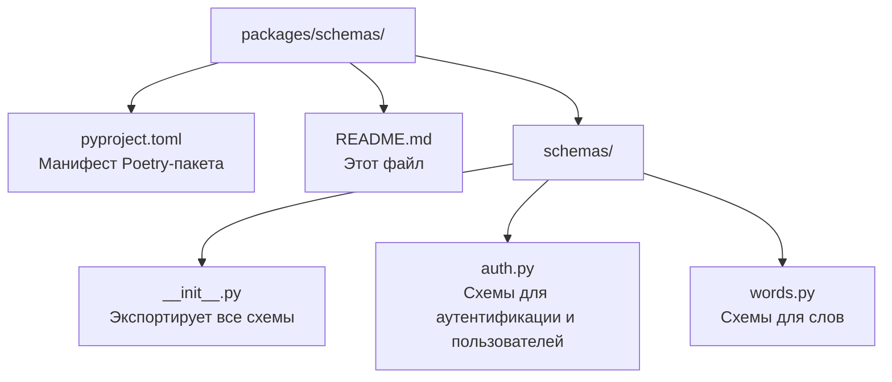

# Пакет `schemas`

Пакет **`schemas`** содержит **Pydantic-схемы** — модели данных, которые описывают формат запросов и ответов API.

> **Для новичка:** Pydantic — это библиотека для валидации данных. Схема — это «шаблон», который описывает, какие поля должны быть у данных, какого они типа и какие ограничения на них наложены. Когда пользователь отправляет запрос, FastAPI проверяет его по схеме: если данные не подходят — вернётся ошибка `422`.

---

## Назначение и роль в системе

- **Валидация входящих данных** — проверка, что запрос от клиента корректен (например, email настоящий, пароль достаточно длинный).
- **Формирование ответов** — описание структуры данных, которые API возвращает клиенту.
- **«Контракт» между клиентом и сервером** — схемы определяют, что «ходит» по API.

Пакет зависит **только от `pydantic`** — это самый простой и независимый пакет проекта.

---

## Структура пакета



### Порядок чтения файлов

1. `pyproject.toml` — понять зависимости (только `pydantic`).
2. `schemas/auth.py` — схемы регистрации, входа, токенов, пользователя.
3. `schemas/words.py` — схемы для работы со словами.
4. `schemas/__init__.py` — как пакет экспортирует схемы наружу.

---

## Схемы в `schemas/auth.py`

### `RegisterRequest`
Данные для **регистрации** нового пользователя.

| Поле | Тип | Ограничения |
|------|-----|-------------|
| `nickname` | str | от 3 до 255 символов |
| `email` | EmailStr | должен быть валидным email |
| `password` | str | от 8 до 128 символов |
| `telegram_nickname` | str? | опционально |

### `LoginRequest`
Данные для **входа** в систему.

| Поле | Тип |
|------|-----|
| `email` | EmailStr |
| `password` | str |

### `RefreshRequest`
Данные для **обновления** access-токена.

| Поле | Тип | Ограничения |
|------|-----|-------------|
| `refresh_token` | str | минимум 1 символ |

### `UserResponse`
**Публичные данные** пользователя (возвращаются клиенту).

| Поле | Тип |
|------|-----|
| `id` | int |
| `nickname` | str |
| `email` | str |
| `telegram_nickname` | str? |

Имеет `model_config = {"from_attributes": True}` — позволяет строить схему прямо из ORM-объекта `User`.

### `TokenResponse`
**Ответ с JWT-токенами**.

| Поле | Тип | По умолчанию |
|------|-----|-------------|
| `access_token` | str | — |
| `refresh_token` | str | — |
| `token_type` | str | `"bearer"` |

---

## Схемы в `schemas/words.py`

### `WordCreateRequest`
Данные для **добавления слова**.

| Поле | Тип | По умолчанию | Ограничения |
|------|-----|-------------|-------------|
| `word_en` | str | — | от 1 до 255 символов |
| `source_lang` | str | `"en"` | исходный язык |
| `target_lang` | str | `"ru"` | целевой язык |

### `WordResponse`
**Слово с переводом** (возвращается клиенту).

| Поле | Тип |
|------|-----|
| `id` | int |
| `word_en` | str |
| `translation` | str? |
| `transcription` | str? |
| `corrected_word` | str? |
| `created_at` | datetime |

Имеет `model_config = {"from_attributes": True}` — строится из ORM-объекта `Word`.

---

## Что такое `from_attributes`?

Обычно Pydantic-схема создаётся из словаря или JSON. Но в этом проекте данные часто приходят из **ORM-объектов** (объектов базы данных, например `User` или `Word`).

`model_config = {"from_attributes": True}` говорит Pydantic: «можно строить эту схему прямо из объекта, читая его атрибуты». Это удобно — не нужно вручную превращать ORM-объект в словарь.

```python
user = User(id=1, nickname="alice", email="alice@example.com", ...)
response = UserResponse.model_validate(user)  # строим схему из ORM-объекта
```

---

## Зависимости

| Пакет/библиотека | Зачем |
|------------------|-------|
| `pydantic` | Базовые классы `BaseModel`, `Field`, `EmailStr` |

Пакет **не зависит** от других пакетов проекта.

---

## Примеры использования

```python
from schemas.auth import RegisterRequest, UserResponse
from schemas.words import WordCreateRequest

# Валидация данных регистрации
req = RegisterRequest(
    nickname="alice",
    email="alice@example.com",
    password="password123",
)

# Если данные невалидны — Pydantic бросит ValidationError
try:
    bad = RegisterRequest(nickname="ab", email="not-an-email", password="short")
except Exception as e:
    print("Ошибка валидации:", e)

# Создание схемы слова
word_req = WordCreateRequest(word_en="hello")
```

---

## Связь с другими пакетами

- **`api`** использует схемы как типы параметров запросов и ответов роутеров. Например, `register(payload: RegisterRequest)` — FastAPI автоматически валидирует тело запроса по схеме.
- **`tests`** проверяют, что схемы корректно валидируют данные (см. `tests/test_schemas.py`).