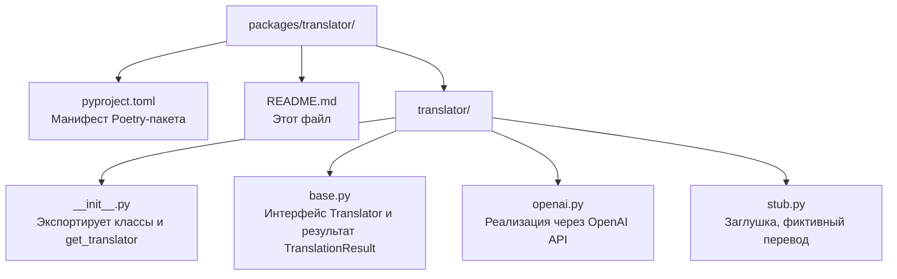

# Пакет `translator`

Пакет **`translator`** — это **сервис перевода слов**. Он определяет абстрактный интерфейс переводчика и предоставляет две реализации: заглушку (`StubTranslator`) и реальную (`OpenAITranslator`).

> **Для новичка:** этот пакет построен на принципе **абстракции**. Вместо того чтобы жёстко привязываться к одному сервису перевода, проект определяет общий «контракт» (интерфейс `Translator`). Любая реализация, которая следует этому контракту, может быть подключена без изменения остального кода.

---

## Назначение и роль в системе

- **Определение интерфейса перевода** — класс `Translator` описывает, как должен работать любой переводчик.
- **Заглушка** — `StubTranslator` возвращает фиктивный перевод, чтобы проект работал без внешних сервисов.
- **Реальная реализация** — `OpenAITranslator` использует OpenAI API для реального перевода.
- **Выбор активного переводчика** — функция `get_translator()` возвращает нужную реализацию в зависимости от настроек.

Пакет зависит от `config` (для настроек OpenAI) и от библиотеки `openai`.

---

## Структура пакета



### Порядок чтения файлов

1. `pyproject.toml` — понять зависимости.
2. `translator/base.py` — интерфейс и структура результата (самое важное).
3. `translator/stub.py` — простая заглушка.
4. `translator/openai.py` — реальная реализация.
5. `translator/__init__.py` — как пакет экспортирует наружу и выбирает переводчика.

---

## Базовые типы в `translator/base.py`

### `TranslationResult`

**Результат перевода** — неизменяемый (frozen) dataclass.

| Поле | Тип | По умолчанию | Описание |
|------|-----|-------------|----------|
| `source_text` | str | — | исходный текст |
| `translated_text` | str | — | перевод |
| `source_lang` | str | — | исходный язык |
| `target_lang` | str | — | целевой язык |
| `transcription` | str | `""` | транскрипция |
| `corrected_word` | str | `""` | исправленное (нормализованное) слово |

### `Translator`

**Абстрактный интерфейс** переводчика. Наследуется от `ABC` (Abstract Base Class).

```python
class Translator(ABC):
    @abstractmethod
    async def translate(self, text, source_lang="en", target_lang="ru") -> TranslationResult:
        ...
```

Любая реализация должна определить метод `translate`. Бизнес-логика проекта зависит только от этого интерфейса, а не от конкретной реализации.

---

## Реализации

### `StubTranslator` (в `translator/stub.py`)

**Заглушка** — возвращает фиктивный перевод, не обращаясь к внешним сервисам.

```python
class StubTranslator(Translator):
    async def translate(self, text, source_lang="en", target_lang="ru"):
        return TranslationResult(
            source_text=text,
            translated_text=f"[заглушка] {text}",
            ...
        )
```

Перевод выглядит как `[заглушка] hello`. Используется, когда нет API-ключа.

### `OpenAITranslator` (в `translator/openai.py`)

**Реальная реализация** через OpenAI API. Возвращает перевод, транскрипцию и исправленное слово.

**Конструктор:**

```python
OpenAITranslator(api_key=None, base_url=None, model="gpt-4o-mini")
```

- `api_key` — ключ OpenAI (если не передан, берётся из переменной окружения `OPENAI_API_KEY`).
- `base_url` — базовый URL (если не передан, из `OPENAI_BASE_URL`).
- `model` — модель OpenAI.

**Как работает `translate`:**

1. Формирует системный промпт, который просит модель вернуть JSON с полями `corrected_word`, `translation`, `transcription`.
2. Отправляет запрос в OpenAI.
3. Разбирает JSON-ответ.
4. Если ответ не JSON — использует текст как перевод.
5. При ошибке API — возвращает результат с сообщением об ошибке (не падает).

---

## Выбор переводчика: `get_translator()`

Функция `get_translator()` (в `translator/__init__.py`) возвращает активный сервис перевода:

```python
def get_translator() -> Translator:
    if settings.openai_api_key:
        return OpenAITranslator(...)
    return StubTranslator()
```

**Логика:**

- Если задан `OPENAI_API_KEY` — возвращается `OpenAITranslator`.
- Иначе — `StubTranslator`.

Это удобно: чтобы «включить» реальный перевод, достаточно указать API-ключ в `.env`. Код приложения не меняется.

---

## Зависимости

| Пакет/библиотека | Зачем |
|------------------|-------|
| `openai` | Клиент для OpenAI API |
| `config` | Настройки OpenAI (ключ, модель, base_url) |

---

## Примеры использования

```python
from translator import get_translator, StubTranslator, OpenAITranslator

# Получить активный переводчик (зависит от настроек)
translator = get_translator()

# Перевести слово
result = await translator.translate("hello", source_lang="en", target_lang="ru")
print(result.translated_text)   # перевод
print(result.transcription)     # транскрипция
print(result.corrected_word)    # исправленное слово

# Использовать заглушку напрямую
stub = StubTranslator()
res = await stub.translate("hello")
print(res.translated_text)  # "[заглушка] hello"
```

---

## Связь с другими пакетами

- **`api`** использует `get_translator()` в роутере слов: при добавлении слова вызывается переводчик, и результат сохраняется в БД.
- **`config`** предоставляет настройки OpenAI.
- **`tests`** проверяют заглушку, реальную реализацию (с моками) и выбор переводчика (см. `tests/test_translator.py`).