# Тесты (`tests/`)

Директория **`tests/`** содержит автоматические тесты проекта. Тесты проверяют, что все части приложения работают корректно: конфигурация, модели, схемы, безопасность, переводчик и API.

> **Для новичка:** тесты — это код, который проверяет другой код. Они запускаются автоматически и сообщают, если что-то сломалось. Тесты — лучший способ понять, как работает проект: они показывают ожидаемое поведение каждой части.

---

## Как запустить тесты

```bash
poetry run pytest
```

Тесты используют **изолированную in-memory базу данных** (SQLite в памяти), поэтому не требуют внешней БД и не влияют друг на друга.

---

## Структура тестов

```mermaid
flowchart TD
    root[tests/]
    root --> init[__init__.py<br/>Пустой файл, делает tests пакетом]
    root --> conftest[conftest.py<br/>Общие фикстуры, клиент API, сессия БД]
    root --> api_auth[test_api_auth.py<br/>Интеграционные тесты роутера аутентификации]
    root --> api_words[test_api_words.py<br/>Интеграционные тесты роутера слов]
    root --> config[test_config.py<br/>Тесты конфигурации]
    root --> dependencies[test_dependencies.py<br/>Тесты зависимости get_current_user]
    root --> main[test_main.py<br/>Тесты корневого эндпоинта]
    root --> models[test_models.py<br/>Тесты моделей БД]
    root --> schemas[test_schemas.py<br/>Тесты Pydantic-схем]
    root --> security[test_security.py<br/>Тесты CORS и безопасности]
    root --> translator[test_translator.py<br/>Тесты сервиса перевода]
```



### Порядок чтения тестов

1. `conftest.py` — понять, как создаётся тестовое окружение (клиент, БД).
2. `test_config.py` — простые тесты конфигурации.
3. `test_models.py` — тесты моделей БД.
4. `test_schemas.py` — тесты валидации данных.
5. `test_security.py` — тесты безопасности.
6. `test_dependencies.py` — тесты зависимости аутентификации.
7. `test_translator.py` — тесты переводчика.
8. `test_api_auth.py` и `test_api_words.py` — интеграционные тесты API.
9. `test_main.py` — тест корневого эндпоинта.

---

## `conftest.py` — общие фикстуры

Этот файл определяет **фикстуры** (fixtures) — готовые объекты, которые pytest автоматически передаёт в тесты.

### `setup_test_env`

Автоматическая фикстура (`autouse=True`), которая настраивает переменные окружения для каждого теста:

- `DATABASE_URL=sqlite+aiosqlite:///:memory:` — in-memory БД.
- `ALLOWED_HOSTS` и `ALLOWED_ORIGINS` — тестовые значения.

### `client`

Асинхронный HTTP-клиент для тестирования API. Создаёт:

- тестовое FastAPI-приложение с роутерами `auth` и `words`,
- изолированную in-memory БД (новый engine на каждый тест),
- переопределяет зависимость `get_db` на тестовую сессию.

Используется в интеграционных тестах API.

### `db_session`

Асинхронная сессия БД для тестов, которые работают с БД напрямую (без FastAPI).

### `ForceCORSMiddleware`

Вспомогательный middleware, который принудительно добавляет CORS-заголовки в ответы (для тестов CORS).

---

## Что тестирует каждый файл

### `test_config.py`
Проверяет конфигурацию:
- значения по умолчанию (`app_name`, `app_version`, `debug`, `host`, `port`, JWT-настройки),
- переопределение значений переменными окружения,
- нечувствительность имён к регистру.

### `test_models.py`
Проверяет модели БД:
- имена таблиц (`users`, `words`),
- наследование от `Base`,
- ограничения колонок (nullable, unique),
- связи `User.words` ↔ `Word.owner`,
- каскадное удаление.

### `test_schemas.py`
Проверяет Pydantic-схемы:
- валидные данные проходят,
- невалидные (короткий nickname, неверный email, короткий пароль) отклоняются,
- построение схем из ORM-объектов (`from_attributes`).

### `test_security.py`
Проверяет безопасность API:
- наличие CORS-заголовков,
- разрешение запросов с любого origin,
- обработку preflight-запросов (OPTIONS),
- работу rate limiting.

### `test_dependencies.py`
Проверяет зависимость `get_current_user`:
- без токена — `401`,
- невалидный токен — `401`,
- просроченный токен — `401`,
- пользователь не найден — `401`,
- валидный токен — возвращает `User`.

### `test_translator.py`
Проверяет сервис перевода:
- `get_translator()` возвращает переводчика,
- `OpenAITranslator` (с моками) — перевод, обработка ошибок API, пустых ответов, некорректного JSON,
- `StubTranslator` — фиктивный перевод.

### `test_api_auth.py`
Интеграционные тесты роутера аутентификации:
- успешная регистрация,
- дубликат — `409`,
- успешный вход,
- неверный пароль — `401`,
- неизвестный email — `401`,
- доступ к `/auth/me` без токена — `401`,
- невалидный токен — `401`,
- валидный токен — данные пользователя,
- обновление токена,
- невалидный/просроченный refresh-токен — `401`,
- access-токен нельзя использовать как refresh — `401`.

### `test_api_words.py`
Интеграционные тесты роутера слов:
- создание слова с переводом,
- создание без токена — `401`,
- список слов,
- получение одного слова,
- слово не найдено — `404`,
- удаление слова,
- изоляция слов между пользователями.

### `test_main.py`
Тест корневого эндпоинта `/` — возвращает `200` и корректный JSON.

---

## Что такое моки (mocks)?

В `test_translator.py` используются **моки** — имитации внешних объектов. Например, вместо реального вызова OpenAI API тест подменяет клиент `AsyncOpenAI` на мок, который возвращает заранее заданный ответ. Это позволяет тестировать логику без реальных сетевых запросов.

```python
with patch("translator.openai.AsyncOpenAI") as mock_openai:
    mock_client = AsyncMock()
    mock_openai.return_value = mock_client
    # ... настраиваем ответ и тестируем
```

---

## Связь с пакетами

Тесты покрывают все пакеты проекта:

| Тест | Пакет |
|------|-------|
| `test_config.py` | `config` |
| `test_models.py` | `database` |
| `test_schemas.py` | `schemas` |
| `test_security.py`, `test_dependencies.py` | `auth`, `api` |
| `test_translator.py` | `translator` |
| `test_api_auth.py`, `test_api_words.py`, `test_main.py` | `api` |